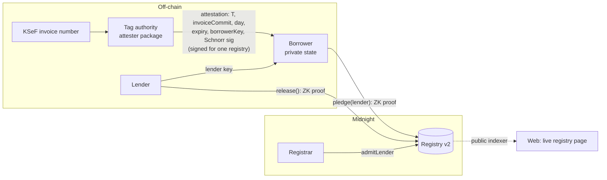

# OnePledge

**One pledge per receivable, across rival lenders, without any lender seeing another's book.**

OnePledge is a registry on [Midnight](https://midnight.network) that refuses to let the same invoice be financed twice. A borrower proves, in zero knowledge, that the tag authority attested an invoice for this registry and that the invoice has never been pledged. The public ledger stores an opaque tag and a note commitment. The financing lender learns the invoice; a rival lender learns only that it is already pledged; the tag authority learns that its invoice was pledged but not to whom; the public learns neither the invoice nor the lender.

This project is built on the Midnight Network.

<!-- links:start -->
| | |
|---|---|
| Live demo | [onepledge.vercel.app](https://onepledge.vercel.app) (runs the compiled circuits in your browser and reads Preprod) |
| Demo video | _added at submission_ |
| Deck | [docs/OnePledge-Wave1-deck.pdf](docs/OnePledge-Wave1-deck.pdf) |
| Security review | [docs/security-review.md](docs/security-review.md) · [threat model](docs/threat-model.md) |
| CI | [](https://github.com/OoJae/onepledge/actions/workflows/ci.yml) |
<!-- links:end -->

Built for the Midnight Buildathon (AKINDO WaveHack), Wave 1.

---

## Live on Midnight Preprod

<!-- v2-deployment:start -->
**Registry v2** · contract [`567df565569f032c0a32a0029fb2fdea9befb8b8ccccb3fb86736f10030c2355`](https://preprod.midnightexplorer.com/contracts/567df565569f032c0a32a0029fb2fdea9befb8b8ccccb3fb86736f10030c2355) · deployed 2026-09-14 in block 2550929 · upgrade key: 1-of-1 deployer key

| Step | Circuit | Transaction | Block | Proved in | Finalized after |
|---|---|---|---|---|---|
| Deploy registry v2 | constructor | [`cad891d71cd3…`](https://preprod.midnightexplorer.com/transactions/cad891d71cd31d93f2647ad27a2aea3df5f3d5281675003cf121fead8d733e21) | 2550929 | | |
| Registrar admits lender A | `admitLender` | [`eb29c1924977…`](https://preprod.midnightexplorer.com/transactions/eb29c19249774d45570bb5efc999fb574b24e7bba1a2b4daf99c1951c0f0ebda) | 2550969 | 1 s | 23.4 s |
| Registrar admits lender B | `admitLender` | [`20cc71fccbab…`](https://preprod.midnightexplorer.com/transactions/20cc71fccbab0c2bc045c327c7a4a3477c62a9bcddb96695910bdc7d6c6ffc5b) | 2550973 | 0.9 s | 22.9 s |
| Borrower pledges invoice 1 to lender A | `pledge` | [`b94a46c0dcb7…`](https://preprod.midnightexplorer.com/transactions/b94a46c0dcb7613b2acc381594201f6af6d602d1a5181a3f225023ff095022cf) | 2550977 | 4.5 s | 23.3 s |
| Borrower re-pledges invoice 1 to lender B | `pledge` | none: rejected before proving: Receivable already pledged | | | |
| Borrower pledges invoice 2 to lender B | `pledge` | [`219fe6b341ff…`](https://preprod.midnightexplorer.com/transactions/219fe6b341ff225650a03ba4e1cca7bacc3ce9a618867c2872657cf67725f62d) | 2550981 | 2.7 s | 23.6 s |
| Lender A releases invoice 1 | `release` | [`8a0eaeecaeb2…`](https://preprod.midnightexplorer.com/transactions/8a0eaeecaeb29f5b74fa4779501021f6b1e798974b56f4fe03dbd664dc8aa2fc) | 2550985 | 2.7 s | 21.9 s |

Step labels come from the operator's run log (`npm run demo`), not from the chain: on chain these are plain `admitLender`, `pledge` and `release` calls that do not say which lender or invoice they concern. Proving ran on a local proof server (Docker, Apple silicon laptop); "finalized after" is from starting the call to the indexer reporting it.
<!-- v2-deployment:end -->

**Registry v1 is deprecated.** The Wave 1 security review found that v1 signed only 248 of the tag's 256 bits, so one attestation could be pledged again with a different last byte. v2 fixes it and adds deployment binding and expiry; see [docs/security-review.md](docs/security-review.md). The v1 record is kept in [`deployments/archive/`](deployments/archive/).

Check that the deployed contract is this repository's contract (no wallet needed):

```bash
npm ci && npm run verify:onchain --workspace cli
```

It compares every circuit's verifier key on chain with `contract/src/managed/registry/keys/*.verifier`, and the sealed tag authority and window with `deployments/preprod.json`.

## The problem

In receivables finance a company borrows against invoices it has issued. The classic fraud is to pledge the same invoice to several lenders. Lenders could catch it by pooling their books, but a lender's client list and pricing are its business, so no lender will show them to a competitor.

The obvious blockchain fix, publishing `hash(invoice number, supplier, amount, due date)` and rejecting repeats, fails in two ways ([both attacks are in the live demo](#1-open-the-live-demo)):

1. **Bypass.** Each bank writes invoice data its own way (`FV/2026/09/0412` vs `FV-2026-09-0412`, `PL5265877635` vs `5265877635`). A different spelling is a different hash, so the second pledge is accepted.
2. **Snooping.** Anyone who knows an invoice's details (the debtor, a lender that saw it during underwriting) can hash them and learn from the public registry whether, and when, it was financed.

## How OnePledge works

- **Canonical identity.** Poland's KSeF e-invoicing system assigns each invoice issued through it a unique 35-character number with a CRC-8 checksum. OnePledge accepts exactly one spelling of it.
- **Keyed tags.** The tag authority computes `T = HMAC-SHA256(tagSecret, KSeF number)`. The same invoice always has the same tag, and without the key nobody can turn an invoice number into its tag, so the public tag set cannot be searched by guessing numbers.
- **Attestation checked in-circuit.** The authority signs one SHA-256 digest of `(domain, registry address, T, invoiceCommit, acceptanceDay, expiresAt, borrowerKey)` with a Jubjub Schnorr key. The `pledge` circuit recomputes the digest and verifies the signature inside the proof. Any change to any field fails, and the attestation is valid only for this registry and until it expires.
- **One pledge, forever.** `pledge` inserts `T` into a public `Set` and fails if it is already there. Tags are never removed.
- **Private lender, private invoice.** The lender is proven to be admitted through a Merkle path, without revealing which lender. The note commitment hides the lender, the invoice commitment and a salt.
- **Unlinkable release.** Only the lender of record can release a pledge. It publishes a nullifier that cannot be linked to the note, the tag or the lender.

### What each party learns

| Party | Learns | Does not learn |
|---|---|---|
| Public (anyone reading the chain) | Tags, note leaf hashes, the roots used, expiry days, nullifiers, counts, timing | Invoice number, amount, debtor, borrower, which lender financed a pledge, which pledge was released |
| Financing lender | The full invoice (it receives the opening of `invoiceCommit` and checks it) | Other lenders' deals |
| Rival lender given a tag | That this invoice is pledged, and, since tags are permanent, its status from then on | By whom, for how much, on what terms |
| Tag authority | Which invoices it attested, the borrower key and invoice commitment it signed, and whether and when each was pledged (it computes the tags, and the tag set is public) | Which lender financed them, or the terms |

Lender keys are public leaves of the admitted-lender tree, so "which lender" is hidden among the admitted lenders, currently a small set.

These properties are enforced by [privacy tests](contract/src/test/privacy.test.ts) that check every value in each circuit's public transcript against an allowlist of what the design publishes. A deliberately leaking contract that published a borrower pseudonym as a field element fails them.

## Why not a trusted registry, and why Midnight

| | Operator-run registry | Public hash registry | OnePledge on Midnight |
|---|---|---|---|
| Who sees each lender's queries and deals | The operator | Nobody | Nobody |
| Can a spelling change dodge it | No | Yes | No: one canonical KSeF number, keyed tag |
| Can outsiders enumerate who financed what | No | Yes | No: tags need the authority's key |
| Is "one pledge per invoice" checked by code anyone can verify | No: trust the operator's database | Yes | Yes: in-circuit, verifier keys on chain |
| What is still trusted | The operator, for everything | Nothing, but it leaks | The tag authority, to tag each invoice once (threshold tags in Wave 3) |

Midnight is what makes the right-hand column possible:
- **Private state with public verification.** The borrower's attestation, secret and the lender's identity stay in local private state; only what the circuit discloses reaches the public ledger.
- **Proofs over private data.** The signature check, lender-membership proof and borrower binding all run inside a zero-knowledge proof.
- **Selective disclosure as code.** Each `disclose()` is a deliberate, testable publication (see [the disclose ledger](docs/threat-model.md#what-each-circuit-publishes-the-disclose-ledger)).
- **Fees without linkage.** DUST fees are shielded, so paying a fee does not identify the party on chain.

## Lender protocol

What a lender does before funding a pledged invoice:

1. **Get the attestation and opening from the borrower.** The borrower hands over the attestation, the invoice fields and the salt behind `invoiceCommit`.
2. **Verify the attestation off-chain.** Use `verifyAttestation(tagAuthority, registryAddress, attestation)` from the attester package. It checks the tag authority's signature for this registry, the same way the circuit does.
3. **Check the tag against the public set.** Use the Live page's "Check a tag" box or the indexer. If the tag is already present, refuse: the invoice is encumbered.
4. **Check the invoice opening.** Use `verifyInvoiceOpening(invoiceCommit, fields, salt)`.
5. **Fund only against a note naming you.** Fund only after a pledge to your lender key lands on chain, then verify the note commitment with the opening you hold.

An honest borrower's client stops before proving when a tag is already pledged. A dishonest one that proves against stale state is rejected when the chain replays the transaction. Encrypted delivery of the opening to the lender is Wave 2.

## Midnight integration

**Public ledger state vs private state**

| Public ledger (`registry.compact`) | Private state (per party, local, [`witnesses.ts`](contract/src/witnesses.ts)) |
|---|---|
| `registrar` (hash of the registrar secret) | Registrar: `secretKey` |
| `tagAuthority`, `windowStart`, `windowEnd` (sealed) | Borrower: `secretKey`, the attestation, target lender key, note salt |
| `lenders` (HistoricMerkleTree of lender keys) | Lender: `secretKey`, the note opening it releases |
| `tags` (Set), `notes` (HistoricMerkleTree), `releases` (Set) | |
| `pledgeCount`, `releaseCount` (Counter) | |

**Transaction lifecycle (CLI, [`cli/src`](cli/src))**
1. **Witnesses:** the compiled contract calls into the party's private state.
2. **Proving:** the local proof server (`httpClientProofProvider`) generates the proof.
3. **Balancing:** the wallet (`WalletFacade`: shielded, unshielded and DUST) pays the fee in DUST.
4. **Submission:** the transaction goes to the Preprod node.
5. **Finalization:** the indexer (`indexerPublicDataProvider`) reports it and exposes the new ledger state.
6. **Storage:** private state is kept encrypted with `levelPrivateStateProvider`, scoped per contract address.

**Upgrade authority.** Midnight contracts have a maintenance authority that can insert or remove verifier keys. For this deployment it is a 1-of-1 key held by the deployer, recorded in `deployments/preprod.json`. Wave 2 moves it to a 2-of-3 committee; Wave 3 freezes a v1.0 deployment.

## Architecture



### Contract: [`contract/src/registry.compact`](contract/src/registry.compact)

Compact toolchain **0.31.1** (language 0.23), the version Preprod runs. 4 provable circuits.

| Circuit | Who runs it | What it proves |
|---|---|---|
| `admitLender(lender)` | Registrar | Caller knows the registrar secret. |
| `rotateRegistrar(next)` | Registrar | Same, then hands the role over. |
| `pledge(lender)` | Borrower | The attestation is bound to the caller's key; the tag authority (not the identity point) signed the digest of the exact body for this registry; the attestation has not expired; the acceptance day is inside the window; the lender is admitted; the tag is new. |
| `release()` | Lender of record | The caller's key is inside a note on the ledger; the nullifier is new. |

- **Identity:** never uses `ownPublicKey()`. Every role key is a domain-separated hash of a witness secret.
- **Signatures:** public networks do not ship `jubjubSchnorrVerify` yet (toolchain 0.32+, ledger 9), so the Schnorr polyfill from [midnightntwrk/example-zkloan](https://github.com/midnightntwrk/example-zkloan) is used, including its bounded-quotient challenge reduction. The signer computes the message and challenge with the contract's own compiled pure circuits.
- **Proving keys:** `pledge` 10.5 MB, `release` 9.5 MB, `admitLender` and `rotateRegistrar` 2.7 MB each.

## Repository layout

```
contract/     Compact contract, witnesses, simulator, tests (vitest)
attester/     KSeF parser (CRC-8, NIP check digit), keyed tags, invoice commitments, signer and verifier
cli/          Headless wallet, deploy, end-to-end demo, verify:onchain
web/          React app: walkthrough on the compiled circuits, attack comparison, live Preprod reader
docs/         Security review, threat model, deck, video script
local-devnet/ Docker Compose for a local Midnight node + indexer (from midnightntwrk/midnight-local-dev)
deployments/  Public record of deployments (active and archived)
```

## How to evaluate

### 1. Open the live demo

[onepledge.vercel.app](https://onepledge.vercel.app) needs no install:
- **The story:** pledge, rejected double pledge and release, running the compiled circuits in your browser.
- **Why not a hash registry:** both attacks, side by side with OnePledge.
- **Live registry:** reads the Preprod contract from the public indexer, with a "Check a tag" box.

The walkthrough runs the compiled circuits against an in-memory ledger: no proofs, no transactions. The Preprod transactions come from the CLI.

### 2. Build and test (about a minute)

Requires Node.js 22.12+ and npm.

```bash
npm ci
npm test                          # contract (137) + attester (39) suites
npm run build --workspace web     # web app
npm run verify:onchain --workspace cli
```

The compiled contract, ZK intermediate files and proving keys are committed, so nothing above needs the Compact toolchain. To recompile (CI does this and fails if the output differs from what is committed):

```bash
curl --proto '=https' --tlsv1.2 -LsSf https://github.com/midnightntwrk/compact/releases/latest/download/compact-installer.sh | sh
compact update 0.31.1
npm run compact    # runs compact compile +0.31.1; the first run downloads about 8 MB of ZK parameters
```

### 3. Run the web app locally

```bash
npm run build --workspace web && npx --workspace web vite preview
```

### 4. Deploy and run the scenario yourself

```bash
docker run -d -p 127.0.0.1:6300:6300 midnightntwrk/proof-server:8.1.0 midnight-proof-server -v

# Preprod
npm run wallet:init --workspace cli     # prints an address; fund it at https://midnight-tmnight-preprod.nethermind.dev/
npm run wallet:daemon --workspace cli   # first sync takes about 2 hours (shielded minutes, DUST the rest)
npm run deploy --workspace cli          # stop the daemon first
npm run demo --workspace cli            # admit lenders, pledge, rejected double pledge, second pledge, release

# Local devnet instead (minutes, no faucet)
docker compose -f local-devnet/standalone.yml up -d node indexer
ONEPLEDGE_NETWORK=undeployed npm run deploy --workspace cli
ONEPLEDGE_NETWORK=undeployed npm run demo --workspace cli
```

- **Secrets:** the wallet mnemonic, tag-authority key and party secrets go into `.secrets/` (mode 0600, git-ignored).
- **Node version and RPC disconnects:** the CLI scripts run on Node 22 through `npx node@22`. The Preprod RPC sometimes closes the WebSocket as a transaction is sent ("Normal Closure"): repeatedly for us under Node 26.0.0, occasionally under Node 22.23 (two of three v2 deploy attempts). Rerunning succeeds; `npm run demo` retries on its own after checking that the ledger counter did not change. The root cause is not isolated.

## Tests

| Suite | Tests | Covers |
|---|---:|---|
| [`registry.test.ts`](contract/src/test/registry.test.ts) | 49 | Deployment; registrar auth and rotation; pledge; five double-pledge variants; forgery (swapped fields, foreign key, tampered response and announcement, other digest, malicious Schnorr reduction); borrower binding; window boundaries; lender paths and historic roots; release authorization, double release, forged note paths |
| [`security.test.ts`](contract/src/test/security.test.ts) | 76 | Regression tests from the security review: every byte of the tag and invoice commitment, stretched expiry, cross-registry replay, expiry boundaries, identity-point authority, off-chain `verifyAttestation` agreeing with the circuit |
| [`privacy.test.ts`](contract/src/test/privacy.test.ts) | 12 | Allowlist of every public value in the pledge, release, admit and rotate transcripts, with positive controls; no private value in public state |
| [`ksef.test.ts`](attester/test/ksef.test.ts) | 16 | Official Ministry of Finance example, CRC-8 check value, malformed spellings, NIP check digit, calendar validation |
| [`tag.test.ts`](attester/test/tag.test.ts) | 17 | Tag determinism and keying, canonical-spelling enforcement, commitment hiding and binding for every field |
| [`signing.test.ts`](attester/test/signing.test.ts) | 6 | Schnorr equation, scalar ranges, nonce freshness, wrong key and message |

- **What the tests run:** the compiled circuits in the simulator. Proof-server-level and racing-transaction tests are Wave 2.
- **Kinds of negative test:** some replace honest witnesses with malicious ones and exercise the circuit's own asserts. Others (missing lender path, unknown note) exercise client-side guards.

## Trust model and known limitations

- **Single tag authority.** Uniqueness relies on the authority tagging each invoice once and keeping its keys safe. A stolen signing key allows forged attestations; a leaked HMAC key lets the holder compute tags for known invoice numbers. Wave 3 replaces it with a verifiable threshold tag.
- **The authority attests existence, not truth.** OnePledge stops the same invoice being financed twice; it does not stop a fabricated invoice.
- **No lender consent yet.** A borrower with a valid attestation can pledge to any admitted lender, which permanently uses the tag. Lender acceptance and a void path are Wave 2.
- **Invoices outside KSeF.** In 2026 some small sellers may still invoice outside KSeF. Lenders should require a KSeF number as a funding condition.
- **Corrections.** A correction invoice has its own KSeF number; the attester must tag it by the root invoice.
- **Tags are permanent.** A released pledge does not free the invoice, and anyone holding a tag can watch its status.
- **Metadata.** DUST fee spends are shielded and do not link parties. What does link activity is network-level: one client submitting several transactions to a shared RPC node, indexer subscriptions, and timing. The CLI demo runs all parties from one machine.
- **Synthetic KSeF numbers** until the Wave 2 test-environment adapter.
- **Upgrade key.** A 1-of-1 deployer maintenance key (see Midnight integration).

## Roadmap

- **Wave 2:**
  - Lace-connected borrower desk and lender inbox on Preprod
  - lender acceptance and a void path
  - facilities with borrowing-base draws
  - encrypted invoice delivery to the lender
  - 2-of-3 registrar and upgrade committee
  - KSeF test-environment adapter
  - proof-server and end-to-end tests in CI
  - conversations with factors and KSeF integrators
- **Wave 3:**
  - verifiable threshold tags, so no single party can compute or sign tags
  - pledge assignment between lenders
  - a reusable uniqueness module for registries with guessable IDs
  - external review

## Attribution

- Schnorr polyfill, wallet construction and UI build setup adapted from [midnightntwrk/example-zkloan](https://github.com/midnightntwrk/example-zkloan) (Apache-2.0).
- Local devnet compose file from [midnightntwrk/midnight-local-dev](https://github.com/midnightntwrk/midnight-local-dev) (Apache-2.0).
- KSeF number format from the Polish Ministry of Finance specification, [CIRFMF/ksef-api](https://github.com/CIRFMF/ksef-api/blob/main/faktury/numer-ksef.md).

## License

[Apache-2.0](LICENSE)
