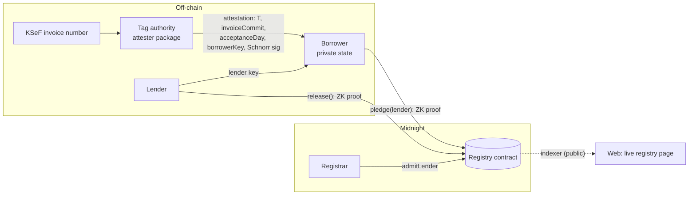

# OnePledge

**One pledge per receivable, across rival lenders, without any lender seeing another's book.**

OnePledge is a registry on [Midnight](https://midnight.network) that refuses to let the same invoice be financed twice. A borrower proves, in zero knowledge, that a tag authority attested an invoice and that the invoice has never been pledged. The public ledger stores only an opaque tag and a commitment. The financing lender learns the invoice, rival lenders learn only "already pledged", and nobody else learns anything.

Built for the Midnight Buildathon (AKINDO WaveHack). Wave 1 submission.

> This project builds on the Midnight Network.

---

## The problem

In receivables finance a company borrows against invoices it has issued. The classic fraud is to pledge the same invoice to several lenders. Lenders could catch it by pooling their books, but a lender's client list and pricing are its business, so no lender will show them to a competitor.

The obvious blockchain fix, publishing `hash(invoice number, supplier, amount, due date)` and rejecting repeats, fails in two ways ([try both attacks in the demo](#run-the-web-demo)):

1. **Bypass.** Each bank writes invoice data its own way (`FV/2026/09/0412` vs `FV-2026-09-0412`, `PL5265877635` vs `5265877635`). A different spelling is a different hash, so the second pledge is accepted.
2. **Snooping.** Anyone holding an invoice (the debtor, a lender that saw it during underwriting) can hash it and learn from the public registry whether, and when, it was financed.

## How OnePledge works

- **Canonical identity.** Poland's KSeF e-invoicing system assigns every B2B invoice a unique 35-character number with a CRC-8 checksum. OnePledge accepts exactly one spelling of it.
- **Keyed tags.** The tag authority computes `T = HMAC-SHA256(tagSecret, KSeF number)`. The same invoice always has the same tag, but nobody without the key can turn an invoice number into its tag, so the public tag set cannot be searched.
- **Attestation checked in-circuit.** The authority signs `(domain, T, invoiceCommit, acceptanceDay, borrowerKey)` with a Jubjub Schnorr key. The `pledge` circuit verifies that signature inside the proof, so fabricated tags are rejected.
- **One pledge, forever.** `pledge` inserts `T` into a public `Set` and fails if it is already there. Tags are never removed, so a released pledge cannot be re-used.
- **Private lender, private invoice.** The lender is proven to be admitted through a Merkle path against a historic registry root, without revealing which lender. The note commitment hides the lender, the invoice commitment and a salt.
- **Unlinkable release.** Only the lender of record can release a pledge. It publishes a nullifier that cannot be linked to the note, the tag or the lender.

### What each party learns

| Observer | Learns | Never learns |
|---|---|---|
| Public (anyone reading the chain) | The tag, an opaque note commitment, the lender-registry root used, pledge and release counts | Invoice number, amount, debtor, borrower, which lender financed it, which pledge was released |
| Financing lender | The full invoice (it receives the opening of `invoiceCommit` off-chain and checks it) | Other lenders' deals |
| Rival lender | That an invoice it was offered is already pledged | By whom, for how much, on what terms |
| Tag authority | Which invoices it attested | Which lender financed them, or whether they were pledged at all (it cannot see which note is whose) |

These properties are pinned by [privacy-leak tests](contract/src/test/privacy.test.ts) that serialize the full public ledger state and every circuit's public transcript and search them for each private value in several encodings.

## Architecture



### Contract: [`contract/src/registry.compact`](contract/src/registry.compact)

Compact toolchain **0.31.1** (language 0.23), the version Preprod runs. 4 provable circuits.

| Ledger field | Type | Purpose |
|---|---|---|
| `registrar` | `Bytes<32>` | Hash of the registrar's secret. Admits lenders. |
| `tagAuthority` | `sealed JubjubPoint` | The only key whose attestations are accepted. |
| `windowStart`, `windowEnd` | `sealed Uint<32>` | Acceptance-date window this deployment accepts. |
| `lenders` | `HistoricMerkleTree<10, Bytes<32>>` | Admitted lender keys, proven by path. |
| `tags` | `Set<Bytes<32>>` | Every receivable ever pledged. |
| `notes` | `HistoricMerkleTree<16, Bytes<32>>` | Pledge note commitments. |
| `releases` | `Set<Bytes<32>>` | Release nullifiers. |
| `pledgeCount`, `releaseCount` | `Counter` | Public activity counters. |

| Circuit | Who runs it | What it proves |
|---|---|---|
| `admitLender(lender)` | Registrar | Caller knows the registrar secret. |
| `rotateRegistrar(next)` | Registrar | Same, then hands the role over. |
| `pledge(lender)` | Borrower | Attestation is bound to the caller's key; tag authority's signature is valid over the exact fields; acceptance day is inside the window; lender is in the registry; tag is new. |
| `release()` | Lender of record | Caller's key is inside a note on the ledger; the nullifier is new. |

**Witnesses** ([`witnesses.ts`](contract/src/witnesses.ts)): the party secret, the attestation, Merkle paths (computed from the ledger with `findPathForLeaf`), the note salt and opening, and the Schnorr challenge reduction.

**Identity** never uses `ownPublicKey()`. Every role key is a domain-separated hash of a witness secret (`onepledge:registrar:v1`, `onepledge:borrower:v1`, `onepledge:lender:v1`).

**Signatures.** Public networks do not ship `jubjubSchnorrVerify` yet (toolchain 0.32+, ledger 9), so the Schnorr polyfill from [midnightntwrk/example-zkloan](https://github.com/midnightntwrk/example-zkloan) is used, including its bounded-quotient challenge reduction. The signer computes the challenge with the contract's own compiled pure circuit, so signer and circuit hash identical bytes.

**Proving keys.** `pledge` 10.5 MB, `release` 9.5 MB, `admitLender` and `rotateRegistrar` 2.7 MB each.

## Repository layout

```
contract/     Compact contract, witnesses, simulator, tests (vitest)
attester/     KSeF parser (CRC-8, NIP check digit), keyed tags, invoice commitments, Schnorr signer
cli/          Headless wallet (with sync snapshots), deploy and end-to-end demo scripts
web/          React app: walkthrough on the real circuits, attack comparison, live Preprod reader
local-devnet/ Docker Compose for a local Midnight node + indexer (from midnightntwrk/midnight-local-dev)
deployments/  Public record of deployments and transaction ids
```

## How to evaluate

### Prerequisites

- Node.js 22+ and Docker
- Compact toolchain 0.31.1:
  ```bash
  curl --proto '=https' --tlsv1.2 -LsSf https://github.com/midnightntwrk/compact/releases/latest/download/compact-installer.sh | sh
  compact update 0.31.1
  ```

### Build and test (no network, no wallet, about a minute)

```bash
npm install
npm run compact        # compiles the contract and generates proving keys
npm test               # contract + attester suites
```

### Run the web demo

```bash
npm run build --workspace web && npx --workspace web vite preview
```

- **The story**: pledge, double-pledge, release, running the compiled circuits in your browser.
- **Why not a hash registry**: both attacks, side by side with OnePledge.
- **Live registry**: reads the Preprod contract from the public indexer. No wallet needed.

The walkthrough runs the compiled circuits against an in-memory ledger. It does not generate proofs or send transactions. Real transactions are made by the CLI.

### Deploy and run the scenario yourself

```bash
docker run -d -p 6300:6300 midnightntwrk/proof-server:8.1.0 midnight-proof-server -v

# Preprod
npm run wallet:init --workspace cli     # prints an address; fund it at https://midnight-tmnight-preprod.nethermind.dev/
npm run wallet:daemon --workspace cli   # syncs, snapshots state, registers NIGHT for DUST
npm run deploy --workspace cli          # stop the daemon first; deploy restores from its snapshot
npm run demo --workspace cli            # admit lenders, pledge, rejected double pledge, second pledge, release

# Local devnet instead
docker compose -f local-devnet/standalone.yml up -d node indexer
ONEPLEDGE_NETWORK=undeployed npm run deploy --workspace cli
ONEPLEDGE_NETWORK=undeployed npm run demo --workspace cli
```

Secrets (wallet mnemonic, tag-authority key, party secrets) are generated into `.secrets/` with mode 0600 and are git-ignored.

## Tests

| Suite | Tests | Covers |
|---|---:|---|
| [`registry.test.ts`](contract/src/test/registry.test.ts) | 49 | Deployment; registrar auth and rotation; pledge; five double-pledge variants (same attestation, second lender, fresh re-attestation, new borrower wallet, after release); ten forgery cases (swapped tag, commitment, day, foreign key, tampered response and announcement, cross-message signature, missing domain separator, out-of-range and forged Schnorr reduction from a malicious prover); borrower binding; window boundaries; forged and mismatched lender paths; historic roots; release authorization, double release, forged note paths |
| [`privacy.test.ts`](contract/src/test/privacy.test.ts) | 7 | No borrower, lender, invoice, salt or signature value in public state or transcripts; unlinkable notes; unlinkable releases |
| [`ksef.test.ts`](attester/test/ksef.test.ts) | 16 | Official Ministry of Finance example, CRC-8 check value, every malformed spelling, NIP check digit, calendar validation |
| [`tag.test.ts`](attester/test/tag.test.ts) | 17 | Tag determinism and keying, canonical-spelling enforcement, commitment hiding and binding for every field |
| [`signing.test.ts`](attester/test/signing.test.ts) | 6 | Schnorr equation, scalar ranges, nonce freshness, wrong key and message |

Every `assert` in the contract has at least one test that makes it fire. Adversarial tests replace honest witnesses with malicious ones, so they exercise the circuit's checks, not the client's.

## Trust model and known limitations (Wave 1)

Stated plainly, because a registry is only as good as its assumptions:

- **Single tag authority.** Uniqueness relies on the authority computing tags deterministically and keeping its HMAC key secret. A dishonest authority could tag one invoice twice under different tags, and a leaked key would let the holder compute tags for known invoice numbers. Wave 3 replaces it with a verifiable threshold tag (DLEQ proofs, 2-of-3 committee).
- **The authority attests existence, not truth.** OnePledge stops the same invoice being financed twice. It does not stop a fabricated invoice; that is the attester's job (KSeF acceptance, audit sampling).
- **Corrections.** A correction invoice has its own KSeF number. The attester must tag corrections by their root invoice; this is a policy of the attester service, not yet enforced by the contract.
- **Synthetic KSeF numbers.** Demo invoices are well-formed but synthetic. The KSeF test-environment adapter is Wave 2.
- **Demo wallet.** The CLI demo pays all parties' fees from one wallet, which links them at the fee level. In production each party uses its own wallet; parties' circuit identities are already independent.
- **Metadata.** Pledge timing, the historic root chosen and fee payments are public.
- **Not yet built.** Facilities and borrowing-base draws, encrypted invoice delivery to the lender, settlement, and a Lace-connected UI are Wave 2.

## Roadmap

- **Wave 2:** Lace-connected borrower desk and lender inbox on Preprod; facilities with borrowing-base draws (`openFacility`, `mergeDraw`); lender envelopes; 2-of-3 registrar; KSeF test-environment adapter; practitioner interviews with factors and KSeF integrators.
- **Wave 3:** verifiable threshold tags (no single party can compute tags); pledge assignment between lenders; reusable `@onepledge/uniqueness` module for any registry with guessable IDs; mutation testing and external review.

## Attribution

- Schnorr polyfill, wallet construction and UI build setup adapted from [midnightntwrk/example-zkloan](https://github.com/midnightntwrk/example-zkloan) (Apache-2.0).
- Local devnet compose file from [midnightntwrk/midnight-local-dev](https://github.com/midnightntwrk/midnight-local-dev) (Apache-2.0).
- KSeF number format from the Polish Ministry of Finance specification, [CIRFMF/ksef-api](https://github.com/CIRFMF/ksef-api/blob/main/faktury/numer-ksef.md).

## License

[Apache-2.0](LICENSE)
